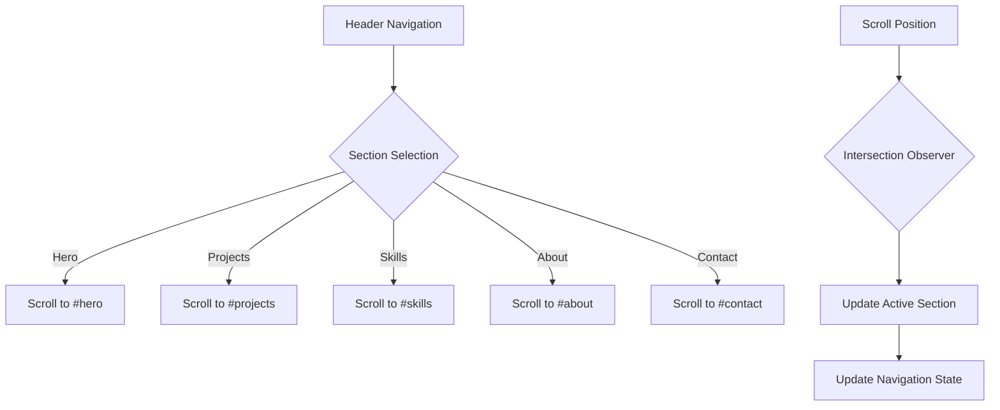

# React Portfolio SPA Design Document

## Overview

A modern, responsive Single Page Application (SPA) built with React that showcases a frontend developer's portfolio through five distinct sections: Hero/Landing, Project Showcase, Technical Skills, About, and Contact Form. The application will feature smooth scrolling navigation, modern animations, interactive code demonstrations, and a professional design that highlights frontend development expertise.

## Technology Stack & Dependencies

### Core Technologies
- **React** (v18+) - Frontend framework
- **React Router DOM** - Client-side routing (if multi-page navigation needed)
- **CSS3/SCSS** - Styling with modern CSS features
- **JavaScript ES6+** - Modern JavaScript features

### Recommended Libraries
- **React Scroll** - Smooth scrolling between sections
- **Framer Motion** - Advanced animations and transitions
- **React Hook Form** - Form handling and validation
- **Swiper.js** - Touch-enabled project carousel
- **React Icons** - Icon library for technology stack
- **Prism.js/React Syntax Highlighter** - Code syntax highlighting
- **Three.js/React Three Fiber** - 3D graphics and animations
- **Lottie React** - Animated illustrations
- **Intersection Observer API** - Scroll-based animations
- **Octokit/GitHub API** - GitHub data integration
- **React GitHub Calendar** - Contribution calendar component
- **Axios/Fetch** - API requests for GitHub data

## Component Architecture

### Component Hierarchy

```
App
├── Header/Navigation
├── Hero Section
├── Project Showcase Section
├── Skills Section  
├── About Section
├── Contact Form Section
└── Footer
```

### Component Definition

#### 1. App Component
- **Purpose**: Main application container and state management
- **Props**: None
- **State**: 
  - `activeSection: string` - Currently active navigation section
  - `isLoading: boolean` - Application loading state
- **Responsibilities**:
  - Manage global application state
  - Handle scroll position tracking
  - Coordinate section visibility

#### 2. Header/Navigation Component
- **Purpose**: Fixed navigation bar with section links
- **Props**: 
  - `activeSection: string` - Current active section
  - `onSectionClick: (section: string) => void` - Section navigation handler
- **State**: 
  - `isMobileMenuOpen: boolean` - Mobile menu visibility
- **Features**:
  - Responsive hamburger menu for mobile
  - Smooth scroll to sections
  - Active section highlighting

#### 3. Hero Section Component
- **Purpose**: Landing section with frontend developer introduction
- **Props**: None
- **State**: 
  - `isAnimated: boolean` - Animation trigger state
  - `typingComplete: boolean` - Typing animation state
- **Content**:
  - Professional headshot/avatar
  - Name and title ("Frontend Developer")
  - Animated typing effect with specializations
  - Technology stack badges (React, JavaScript, CSS, etc.)
  - Call-to-action buttons (View Projects, Download Resume)
  - Interactive background with floating code elements
  - Live code editor demonstration

#### 4. Project Showcase Section Component
- **Purpose**: Interactive showcase of frontend development projects with GitHub integration
- **Props**: 
  - `projects: ProjectItem[]` - Array of frontend projects
  - `githubUsername: string` - GitHub username for API calls
- **State**: 
  - `currentProject: number` - Active project index
  - `viewMode: 'gallery' | 'detail'` - Display mode
  - `filterCategory: string` - Project filter
  - `githubData: GitHubRepoData[]` - Live GitHub repository data
  - `isLoadingGitHub: boolean` - GitHub API loading state
- **Features**:
  - Interactive project previews with hover effects
  - Live demo links and GitHub repositories
  - **Real-time GitHub stats** (stars, forks, last updated)
  - **Live commit history** and recent activity
  - **Repository languages** and file structure preview
  - **Issue and PR counts** from GitHub API
  - Technology stack filtering (React, Vue, Vanilla JS)
  - Code snippet previews with syntax highlighting
  - Responsive design showcases
  - Performance metrics display (Lighthouse scores)
  - **GitHub Actions** build status indicators

#### 5. Skills Section Component
- **Purpose**: Display frontend development skills and competencies
- **Props**: 
  - `skills: SkillItem[]` - Array of frontend skills
- **State**: 
  - `animatedSkills: boolean[]` - Animation state per skill
  - `selectedCategory: string` - Active skill category
- **Features**:
  - Interactive skill cards with animated progress indicators
  - Categorization (Languages, Frameworks, Tools, Design)
  - Mini code examples for each technology
  - Certification badges and achievements
  - Years of experience indicators
  - Interactive technology logos with hover animations
  - Skill assessment with visual proficiency levels

#### 6. About Section Component
- **Purpose**: Frontend developer's professional journey with GitHub analytics
- **Props**: 
  - `aboutData: AboutContent` - About section content
  - `githubUsername: string` - GitHub username
- **State**: 
  - `expandedInfo: boolean` - Expanded text state
  - `timelineView: boolean` - Timeline display mode
  - `githubStats: GitHubStats` - GitHub profile statistics
  - `contributionData: ContributionData[]` - GitHub contributions
- **Content**:
  - Professional photo with CSS animations
  - Frontend development journey story
  - Interactive career timeline with project milestones
  - **GitHub contribution calendar** with activity heatmap
  - **Live GitHub statistics** (total repos, commits, stars received)
  - **Most used programming languages** from GitHub
  - **Contribution streak** and coding activity patterns
  - Frontend specializations and passion areas
  - Development philosophy and approach
  - Favorite tools and technologies
  - **GitHub profile README** integration
  - Downloadable resume with frontend focus

#### 7. Contact Form Section Component
- **Purpose**: Contact form with validation
- **Props**: 
  - `onSubmit: (formData: FormData) => void` - Form submission handler
- **State**: 
  - `formData: FormData` - Form input values
  - `errors: FormErrors` - Validation errors
  - `isSubmitting: boolean` - Submission state
  - `submitStatus: 'idle' | 'success' | 'error'` - Submission result
- **Features**:
  - Real-time validation
  - Success/error feedback
  - Accessibility compliance
  - Spam protection

### Data Models

```javascript
// Project Item Interface with GitHub Integration
interface ProjectItem {
  id: string;
  title: string;
  description: string;
  imageUrl: string;
  liveUrl?: string;
  githubUrl: string; // Required for GitHub integration
  repositoryName: string; // GitHub repo name
  codePreview?: string;
  technologies: string[];
  category: 'react' | 'vue' | 'vanilla' | 'mobile';
  performance: {
    lighthouse: number;
    loadTime: string;
  };
  features: string[];
  challenges: string[];
  githubData?: GitHubRepoData; // Live GitHub data
}

// GitHub Repository Data Interface
interface GitHubRepoData {
  stars: number;
  forks: number;
  watchers: number;
  openIssues: number;
  language: string;
  languages: { [key: string]: number };
  lastUpdated: string;
  createdAt: string;
  size: number;
  defaultBranch: string;
  topics: string[];
  hasPages: boolean;
  commits: number;
  contributors: number;
}

// GitHub Profile Statistics
interface GitHubStats {
  totalRepos: number;
  totalStars: number;
  totalCommits: number;
  totalPRs: number;
  totalIssues: number;
  followers: number;
  following: number;
  contributionYears: number[];
  currentStreak: number;
  longestStreak: number;
  topLanguages: { [key: string]: number };
}

// GitHub Contribution Data
interface ContributionData {
  date: string;
  count: number;
  level: 0 | 1 | 2 | 3 | 4;
}

// Frontend Skill Item Interface
interface SkillItem {
  id: string;
  name: string;
  level: number; // 1-100
  category: 'languages' | 'frameworks' | 'tools' | 'design' | 'testing';
  icon?: string;
  yearsExperience: number;
  codeExample?: string;
  certifications?: string[];
  projects?: string[]; // Related project IDs
}

// About Content Interface
interface AboutContent {
  title: string;
  description: string;
  experience: ExperienceItem[];
  education: EducationItem[];
  interests: string[];
  resumeUrl: string;
}

// Form Data Interface
interface FormData {
  name: string;
  email: string;
  subject: string;
  message: string;
}
```

## Routing & Navigation

### Single Page Navigation
- **Anchor-based navigation** using section IDs
- **Smooth scrolling** between sections
- **URL hash updates** to reflect current section
- **Browser back/forward** support for section navigation

### Navigation Flow


## Styling Strategy

### CSS Architecture
- **CSS Modules** or **Styled Components** for component-scoped styling
- **SCSS** for advanced CSS features and variables
- **CSS Grid/Flexbox** for responsive layouts
- **CSS Custom Properties** for theming

### Design System
- **Color Palette**: Primary, secondary, accent colors with dark/light modes
- **Typography Scale**: Consistent font sizes and line heights
- **Spacing System**: 8px grid system for consistent spacing
- **Breakpoints**: Mobile-first responsive design

### Animation Strategy
- **Framer Motion** for complex animations
- **CSS Transitions** for simple hover effects
- **Intersection Observer** for scroll-triggered animations
- **Performance optimization** with `will-change` and `transform`

## State Management

### Local Component State
- **useState** for simple component state
- **useEffect** for lifecycle management
- **useCallback/useMemo** for performance optimization

### Global State Management
```javascript
// Context for global application state
const AppContext = createContext({
  activeSection: 'hero',
  theme: 'light',
  isLoading: false,
  setActiveSection: () => {},
  toggleTheme: () => {},
  setIsLoading: () => {}
});

// Custom hooks for state management
const useScrollPosition = () => {
  // Track scroll position and update active section
};

const useIntersectionObserver = (options) => {
  // Monitor element visibility for animations
};
```

## API Integration Layer

### GitHub API Integration
```javascript
// GitHub Service for API calls
const GitHubService = {
  // Get user profile information
  getProfile: async (username) => {
    const response = await fetch(`https://api.github.com/users/${username}`);
    return await response.json();
  },

  // Get user repositories
  getRepositories: async (username, page = 1, perPage = 30) => {
    const response = await fetch(
      `https://api.github.com/users/${username}/repos?page=${page}&per_page=${perPage}&sort=updated`
    );
    return await response.json();
  },

  // Get specific repository details
  getRepository: async (username, repoName) => {
    const response = await fetch(`https://api.github.com/repos/${username}/${repoName}`);
    return await response.json();
  },

  // Get repository languages
  getRepositoryLanguages: async (username, repoName) => {
    const response = await fetch(`https://api.github.com/repos/${username}/${repoName}/languages`);
    return await response.json();
  },

  // Get repository commits
  getRepositoryCommits: async (username, repoName, page = 1) => {
    const response = await fetch(
      `https://api.github.com/repos/${username}/${repoName}/commits?page=${page}&per_page=10`
    );
    return await response.json();
  },

  // Get user events (contributions)
  getUserEvents: async (username, page = 1) => {
    const response = await fetch(
      `https://api.github.com/users/${username}/events?page=${page}&per_page=30`
    );
    return await response.json();
  },

  // Get user statistics
  getUserStats: async (username) => {
    const [profile, repos, events] = await Promise.all([
      GitHubService.getProfile(username),
      GitHubService.getRepositories(username, 1, 100),
      GitHubService.getUserEvents(username, 1)
    ]);

    return {
      profile,
      totalRepos: profile.public_repos,
      totalStars: repos.reduce((sum, repo) => sum + repo.stargazers_count, 0),
      totalForks: repos.reduce((sum, repo) => sum + repo.forks_count, 0),
      languages: await GitHubService.aggregateLanguages(username, repos),
      recentActivity: events.slice(0, 10)
    };
  },

  // Aggregate languages across all repositories
  aggregateLanguages: async (username, repos) => {
    const languagePromises = repos.map(repo => 
      GitHubService.getRepositoryLanguages(username, repo.name)
    );
    
    const languageResults = await Promise.all(languagePromises);
    const aggregated = {};
    
    languageResults.forEach(languages => {
      Object.entries(languages).forEach(([lang, bytes]) => {
        aggregated[lang] = (aggregated[lang] || 0) + bytes;
      });
    });
    
    return aggregated;
  }
};

// Custom hook for GitHub data
const useGitHubData = (username) => {
  const [data, setData] = useState(null);
  const [loading, setLoading] = useState(true);
  const [error, setError] = useState(null);

  useEffect(() => {
    const fetchGitHubData = async () => {
      try {
        setLoading(true);
        const githubStats = await GitHubService.getUserStats(username);
        setData(githubStats);
      } catch (err) {
        setError(err.message);
      } finally {
        setLoading(false);
      }
    };

    if (username) {
      fetchGitHubData();
    }
  }, [username]);

  return { data, loading, error };
};
```

### Contact Form Integration
```javascript
// Form submission service
const ContactService = {
  submitForm: async (formData) => {
    // Integration with EmailJS, Netlify Forms, or custom API
    return await fetch('/api/contact', {
      method: 'POST',
      headers: { 'Content-Type': 'application/json' },
      body: JSON.stringify(formData)
    });
  }
};
```

### Content Management with GitHub Integration
- **GitHub API** for live repository data and statistics
- **Repository metadata** fetched in real-time
- **Contribution calendar** data from GitHub
- **Language statistics** aggregated from all repositories
- **Commit history** and activity timeline
- **Static JSON files** for additional frontend projects and skills data
- **Markdown files** for technical blog posts and project documentation
- **Image optimization** with WebP/AVIF for project screenshots
- **Code snippet management** with syntax highlighting
- **Content validation** with TypeScript interfaces
- **Dynamic project metrics** from GitHub and deployment platforms
- **Caching strategy** for GitHub API responses to avoid rate limits
- **Fallback data** for offline or API failure scenarios

## Testing Strategy

### Unit Testing
- **Jest** for unit test framework
- **React Testing Library** for component testing
- **Testing scenarios**:
  - Component rendering
  - User interactions (clicks, form submissions)
  - State management
  - Navigation functionality

### Integration Testing
- **Form submission workflow**
- **Navigation between sections**
- **Responsive behavior**
- **Animation triggers**

### Accessibility Testing
- **Keyboard navigation**
- **Screen reader compatibility**
- **Color contrast ratios**
- **ARIA labels and roles**

## Performance Considerations

### GitHub API Optimization
- **Rate limiting** awareness (5000 requests/hour for authenticated users)
- **Caching strategy** with localStorage for GitHub data
- **Background data fetching** to avoid blocking UI
- **Incremental loading** of repository data
- **Error handling** for API failures with fallback content

### Optimization Strategies
- **Code splitting** by sections/routes
- **Lazy loading** for images and GitHub components
- **Memoization** of expensive GitHub data calculations
- **Debounced API calls** for search and filtering
- **Image optimization** with WebP/AVIF formats
- **Service Worker** for caching GitHub API responses

### Loading Strategy with GitHub Integration
```mermaid
raph LR
    A[Initial Load] --> B[Critical CSS]
    B --> C[Hero Section]
    C --> D[GitHub API - Profile Data]
    D --> E[Lazy Load Other Sections]
    E --> F[GitHub API - Repository Data]
    F --> G[Preload Images]
    G --> H[Animation Libraries]
    H --> I[GitHub Contribution Calendar]
```

## Accessibility Features

### WCAG Compliance
- **Semantic HTML** structure
- **ARIA labels** for interactive elements
- **Keyboard navigation** support
- **Focus management** between sections
- **Alt text** for all images
- **Color contrast** meeting AA standards

### Screen Reader Support
- **Skip links** for main content
- **Heading hierarchy** (h1-h6)
- **Form labels** and error messages
- **Live regions** for dynamic content updates

## Security Considerations

### Form Security
- **Input sanitization** on client-side
- **CSRF protection** for form submissions
- **Rate limiting** for contact form
- **Spam protection** with reCAPTCHA or honeypot

### Content Security
- **XSS prevention** through proper escaping
- **Secure image sources**
- **External link security** with rel="noopener noreferrer"foi